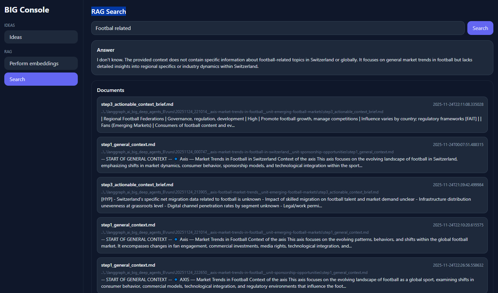

# BIG RAG Platform

End-to-end Retrieval-Augmented Generation (RAG) companion for the **Business Idea Generator (BIG)**.

This project:

- Scans BIG run folders (e.g. `../../langgraph_ai_big_deep_agents_B/runs`)
- Embeds all relevant files into a persistent vector database (Chroma + SQLite)
- Supports delta indexing (only new/changed files are re-embedded, deleted files are removed)
- Exposes a **FastAPI** RAG service using **LangChain + LangGraph**
- Generates a **Mermaid** diagram + PNG of the agentic architecture on startup
- Provides a **Django + React** UI with:
  - Left menu: **Ideas** (Business / Product / Other) and **RAG** (Perform embeddings / Search)
  - RAG Search with modern UX listing matching documents and an optional LLM answer

The architecture is modular so you can containerise `backend` and `frontend` into separate Docker/Kubernetes services.

---

## 1. Project structure

```text
big_rag_project/
├─ .env.example              # Sample environment variables
├─ README.md
├─ backend/
│  ├─ requirements.txt
│  └─ app/
│     ├─ __init__.py
│     ├─ main.py             # FastAPI app with /rag/embed and /rag/search
│     ├─ core/
│     │  ├─ settings.py      # Loads .env and centralises config
│     │  └─ logging_config.py
│     ├─ rag/
│     │  ├─ __init__.py
│     │  ├─ embeddings.py    # Provider strategy (OLLAMA / OPENAI / ANTHROPIC)
│     │  ├─ vectorstore.py   # Chroma vector DB wrapper
│     │  ├─ file_scanner.py  # Delta detection + document building
│     │  └─ graph.py         # LangGraph RAG pipeline
│     └─ mermaid/
│        └─ diagram.py       # Mermaid diagram + PNG generation
└─ frontend/
   ├─ requirements.txt
   ├─ manage.py
   ├─ big_ui/
   │  ├─ __init__.py
   │  ├─ settings.py
   │  ├─ urls.py
   │  ├─ asgi.py
   │  └─ wsgi.py
   ├─ ideas/
   │  ├─ __init__.py
   │  ├─ apps.py
   │  ├─ urls.py
   │  └─ views.py
   ├─ templates/
   │  └─ index.html          # Django template bootstrapping React app
   └─ static/
      └─ app.js              # React SPA (sidebar + pages)
```

---

## 2. Environment variables

Copy `.env.example` to `.env` at the project root and adjust as needed:

```bash
cp .env.example .env
```

Key variables:

```env
INDEX_DIR="../../langgraph_ai_big_deep_agents_B/runs"  # Where your BIG run folders live
EMBEDDING_DIR="./data/embeddings"                   # Where Chroma (SQLite) is stored

OPENAI_API_KEY=""                                   # If using OpenAI
ANTHROPIC_API_KEY=""                                # If using Anthropic
OLLAMA_URL="http://localhost:11434"                 # If using Ollama
OLLAMA_LLM_MODEL="qwen2.5-coder:7b-8k"
OLLAMA_EMBEDDING_MODEL="nomic-embed-text"
OPENAI_EMBEDDING_MODEL="text-embedding-3-small"
ANTHROPIC_EMBEDDING_MODEL="text-embedding-3-small"

USE_PROVIDER="OLLAMA"  # OLLAMA, OPENAI, or ANTHROPIC

LOG_LEVEL="INFO"
DB_LOG_LEVEL="INFO"
```

- `INDEX_DIR` should point to the `runs` folder of your existing BIG project, e.g.:
  `C:\Users\...\langgraph_ai_big_deep_agents_B\runs` (Windows) or `/home/.../runs` (Linux/macOS).
- `EMBEDDING_DIR` can be any writeable folder; Chroma will create persistent data there.

---

## 3. Backend (FastAPI + LangChain + LangGraph)

### 3.1. Install dependencies

```bash
cd backend
python -m venv .venv
source .venv/bin/activate  # Windows: .venv\Scripts\activate
pip install -r requirements.txt
```

Make sure `big_rag_project/.env` exists and is correctly configured.

### 3.2. Run the backend

```bash
uvicorn app.main:app --reload --host 0.0.0.0 --port 8009
```

On startup, the backend will:

- Load configuration from `.env`
- Configure logging
- Generate a **Mermaid** diagram at:

  - `<EMBEDDING_DIR>/../diagrams/agent_architecture.mmd`
  - `<EMBEDDING_DIR>/../diagrams/agent_architecture.png` (if `mmdc` is installed)

#### Optional: Mermaid PNG rendering

To get the PNG automatically, install Mermaid CLI in your environment:

```bash
npm install -g @mermaid-js/mermaid-cli
```

The backend uses:

```bash
mmdc -i agent_architecture.mmd -o agent_architecture.png
```

If `mmdc` is not found, a warning is logged but the service still runs.

### 3.3. RAG endpoints

- `POST /rag/embed`

  - Scans `INDEX_DIR` recursively
  - Supports **delta indexing**:
    - New files → embedded
    - Changed files (hash diff) → old vectors removed, new ones added
    - Deleted files → removed from vector DB
  - Splits text into chunks with `RecursiveCharacterTextSplitter`
  - Stores metadata:

    ```jsonc
    {
      "file_path": "...",
      "file_name": "...",
      "file_hash": "...",
      "chunk_index": 0,
      "created_at": "ISO timestamp",
      "modified_at": "ISO timestamp",
      "user_id": "global"
    }
    ```

  - Returns:

    ```json
    {
      "indexed_documents": 42,
      "new_files": 3,
      "updated_files": 2,
      "deleted_files": 1
    }
    ```

- `GET /rag/search?q=...&user_id=&with_answer=true`

  - Guardrails:
    - Rejects empty queries
    - Rejects overly long queries (>1024 chars)
    - Blocks dangerous patterns like `"ignore previous instructions"` / `"delete all data"`
  - Uses Chroma similarity search over stored documents (optionally filtered by `user_id`)
  - Returns:

    - `results`: list of matching document chunks with metadata & snippet
    - `answer`: optional LLM answer using **LangGraph** pipeline:

      ```text
      retrieve → generate → END
      ```

      where:

      - `retrieve` node: runs similarity search and builds joined context
      - `generate` node: calls LLM (Ollama/OpenAI/Anthropic) with a strict system prompt:
        - Use ONLY context
        - Say “I don’t know” if context is insufficient

---

## 4. Frontend (Django + React)

The frontend is intentionally lightweight but modern:

- Django serves a single template (`index.html`)
- React (via CDN) renders a SPA with:
  - Left sidebar:
    - **Ideas**
    - **Perform embeddings**
    - **Search**
  - Central content:
    - Ideas: tabs for _Business_, _Product_, _Other_ (placeholder to connect to BIG later)
    - RAG → Perform embeddings: button to call backend `/rag/embed`
    - RAG → Search: search box + answer panel + document results list

### 4.1. Install frontend dependencies

```bash
cd ../frontend
python -m venv .venv
source .venv/bin/activate  # Windows: .venv\Scripts\activate
pip install -r requirements.txt
```

You can configure where the Django UI expects the backend via env var:

```bash
export RAG_API_BASE="http://localhost:8009"  # default
```

Or on Windows PowerShell:

```powershell
$env:RAG_API_BASE="http://localhost:8009"
```

### 4.2. Run the frontend

```bash
python manage.py migrate
python manage.py runserver 0.0.0.0:8010
```

Open: <http://localhost:8010>

### 4.3. UI overview

- **Sidebar**

  - _Ideas_
  - _RAG → Perform embeddings_
  - _RAG → Search_

- **Ideas page**

  - Tabs:
    - Business Ideas
    - Product Ideas
    - Other Ideas
  - Currently a UX placeholder where you can later plug your existing idea flows.

- **RAG → Perform embeddings**

  - Description of the delta embedding process
  - Button:
    - Calls `POST /rag/embed`
    - Shows counts: indexed documents / new / updated / deleted

- **RAG → Search**
  - Free-text search box:
    - Calls `GET /rag/search?q=...&with_answer=true`
  - **Answer** panel:
    - Shows the LLM answer from LangGraph pipeline
  - **Documents** panel:
    - Card list of chunks:
      - File name
      - File path
      - Created/modified timestamp
      - Snippet

---

## 5. RAG design & guardrails

### 5.1. Modularity

- **Embeddings**:
  - `app/rag/embeddings.py` selects proper strategy based on `USE_PROVIDER`:
    - Ollama
    - OpenAI
    - Anthropic
- **Vector DB**:
  - `app/rag/vectorstore.py` wraps Chroma + SQLite
  - Easy to swap for another store if needed
- **File scanner**:
  - `app/rag/file_scanner.py`:
    - Detects new / changed / deleted files
    - Builds LangChain `Document` objects with rich metadata
- **Graph orchestration**:
  - `app/rag/graph.py`:
    - Defines LangGraph RAG state and nodes

This modularity makes it easy to split into separate Docker/Kubernetes services:

- `big-rag-backend`
- `big-rag-frontend`

### 5.2. Guardrails for retrieval

Implemented in `app/main.py`:

- **Query validation**:
  - Not empty
  - Length limit: 1024 chars
  - Basic pattern blocking:
    - `ignore previous instructions`
    - `delete all data`
- **Access control ready**:
  - All indexed docs carry `user_id` metadata (currently `"global"`)
  - `/rag/search` accepts optional `user_id` and filters by it
  - Future step: propagate authenticated user IDs from Django → FastAPI
- **Result constraints**:
  - Max `k=5` docs per query
  - Explicit system prompt for LLM:
    - No hallucinated answers; if context is insufficient, answer “I don’t know”.

---

## 6. End-to-end run (step by step)

1. **Clone / copy this project**

   Place it somewhere close to your BIG repository, e.g.:

   ```text
   /projects/
     langgraph_ai_big_deep_agents_B/
       runs/
     big_rag_project/
   ```

2. **Create and configure `.env`**

   ```bash
   cd big_rag_project
   cp .env.example .env
   # edit .env and point INDEX_DIR to your BIG runs directory
   ```

3. **Start the backend**

   ```bash
   cd backend
   python -m venv .venv
   source .venv/bin/activate
   pip install -r requirements.txt
   uvicorn app.main:app --reload --host 0.0.0.0 --port 8009
   ```

4. **Start the frontend**

   ```bash
   cd ../frontend
   python -m venv .venv
   source .venv/bin/activate
   pip install -r requirements.txt
   python manage.py migrate
   python manage.py runserver 0.0.0.0:8010
   ```

5. **Use the UI**

   - Visit <http://localhost:8010>
   - Go to **RAG → Perform embeddings**
     - Click “Run embed delta”
     - Wait for counts to appear
   - Go to **RAG → Search**
     - Ask something like:
       - “List key risks mentioned for sponsorship opportunities”
       - “What market trends are described for youth football development?”
     - Review:
       - Answer
       - Linked document snippets



6. **Inspect the architecture diagram**

   - Check `<EMBEDDING_DIR>/../diagrams/agent_architecture.mmd`
   - If `mmdc` is installed, also see `agent_architecture.png`

---

## 7. Next steps / extensions, to be done

- Plug the **Ideas** page into your existing BIG pipeline API
- Enrich metadata:
  - `axis`, `unit`, `run_id`, `idea_id`, etc.
- Implement authentication and real **user_id** separation
- Add more advanced guardrails (e.g. policy-based filters, PII masking)
- Containerise:
  - Dockerfile for backend and frontend
  - Helm chart / K8s manifests for scaling `rag-backend` independently

This baseline gives you a clean, modular, and UX-friendly RAG layer around your existing BIG run artefacts.

## Mermaid Diagram

The `.mmd` file is generated automatically.  
To manually render PNG:

```
mmdc -i agent_architecture.mmd -o agent_architecture.png


```
